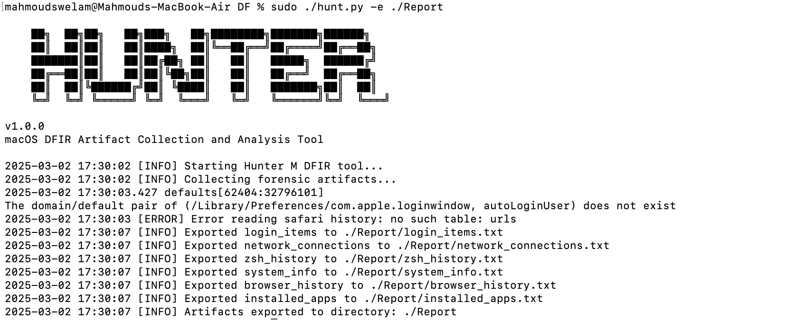

# HunterM - macOS Forensics 🕵️‍♂️

### A powerful macOS DFIR artifact collection tool for forensic analysis.

HunterM is a **digital forensics tool** designed to collect and analyze **key macOS forensic artifacts**. It is useful for **incident response, threat hunting, and compromise assessments**.

---

## 🚀 **Features**
- ✅ Collects **Login Items, Network Connections, Extended Zsh History**
- ✅ Retrieves **System Information** (OS, kernel, timezone)
- ✅ Extracts **Browser History** (Safari, Chrome, Firefox)
- ✅ Lists **Installed Applications**
- ✅ Exports collected artifacts into **structured reports**
- ✅ **No dependencies** (except `colorama` for colored output)

